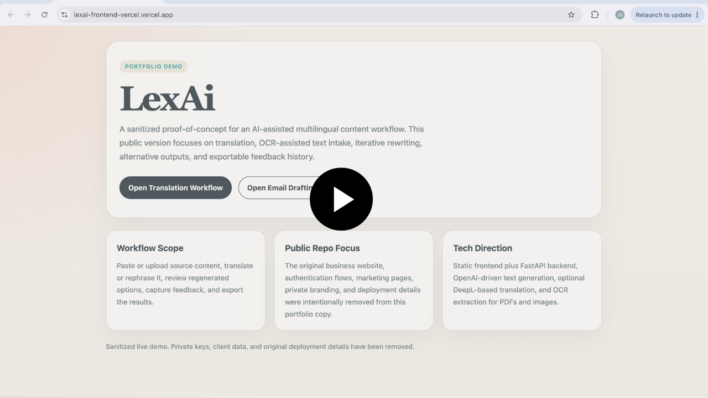
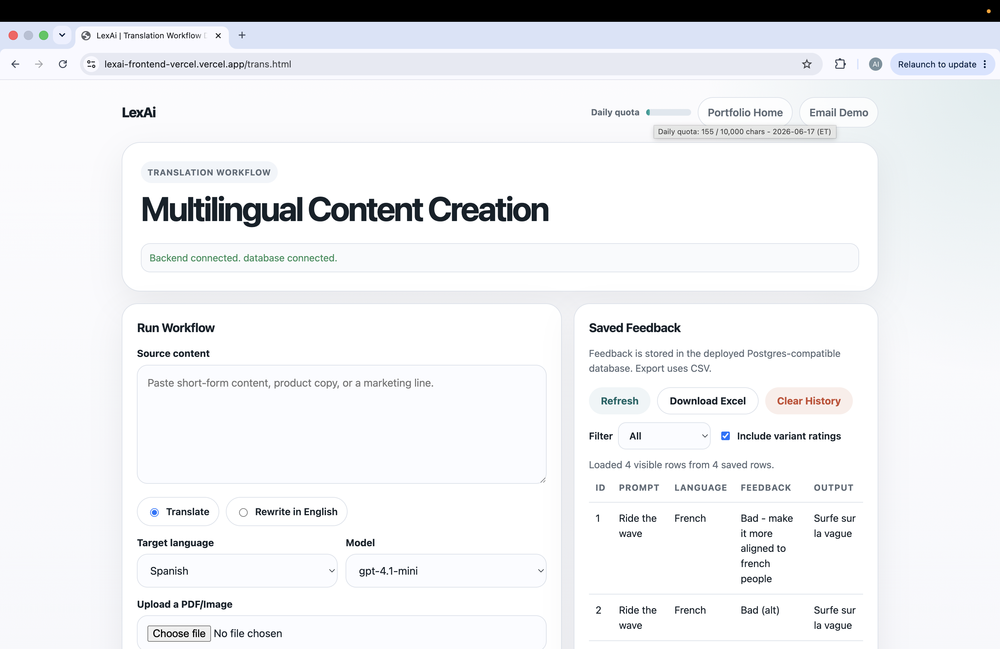
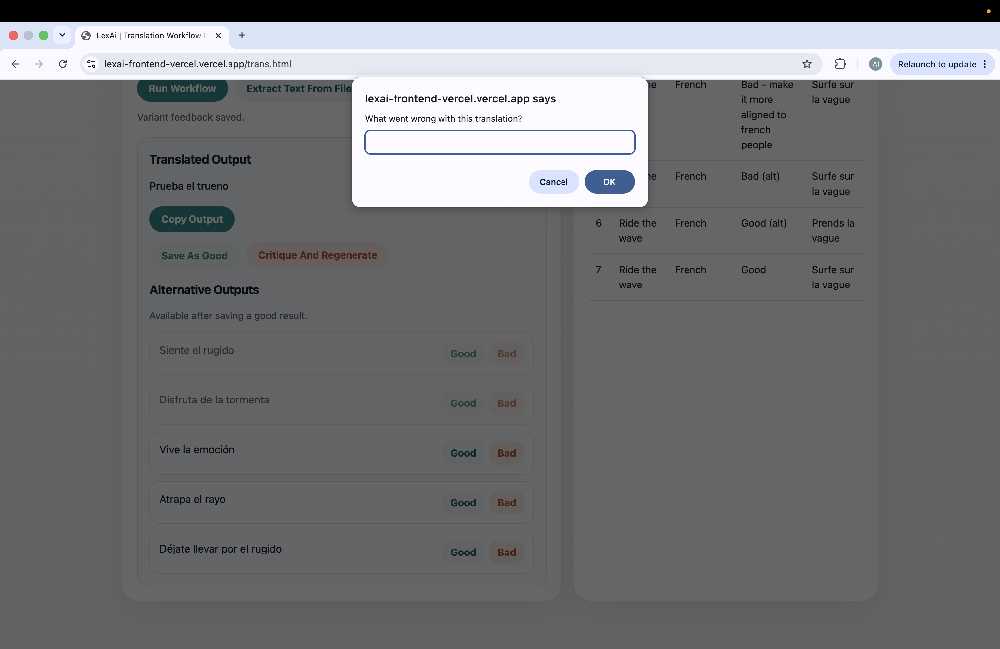
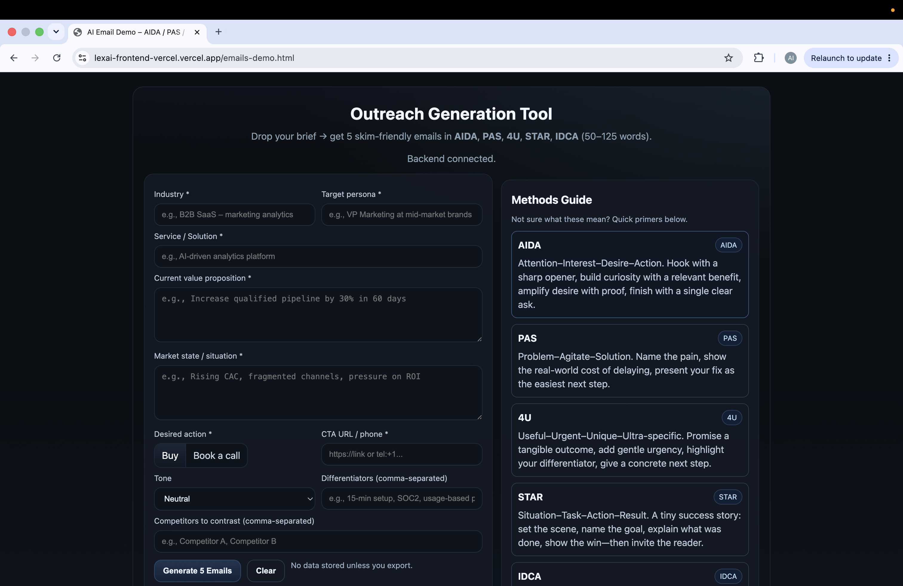
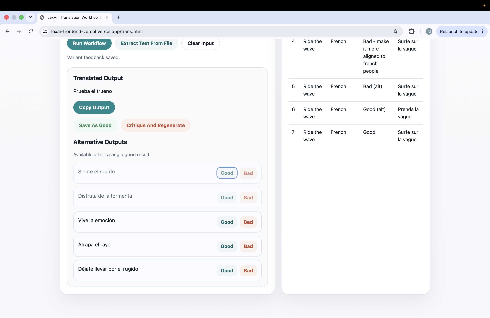

# Demo Walkthrough

This page collects the public demo assets for LexAi in one place: the live links, the recorded walkthrough, and a small screenshot set that shows the main workflow surfaces without turning the documentation into a giant image dump.

## Watch The Demo

- Live frontend: `https://lexai-frontend-vercel.vercel.app`
- Backend health check: `https://lexai-backend-vercel.vercel.app/healthz`

## What The Walkthrough Covers

- landing page and live deployment entry point
- multilingual translation workflow
- critique-and-regenerate flow
- alternative output generation
- secondary email drafting demo

The screenshots below are intentionally limited to the cleaner public-facing states of the product. They are here to support the walkthrough, not replace it.

## Screenshot Gallery

<table>
  <tr>
    <td width="50%">
      
    </td>
    <td width="50%">
      
    </td>
  </tr>
  <tr>
    <td width="50%">
      
    </td>
    <td width="50%">
      
    </td>
  </tr>
</table>

## Notes

- The walkthrough and screenshots reflect the sanitized public demo, not the full original private product.
- Private branding, client data, secrets, and original deployment details have been removed.
- The live demo is real and deployed, but it still reflects the practical limits documented elsewhere in this repo, especially around OCR and serverless hosting.
